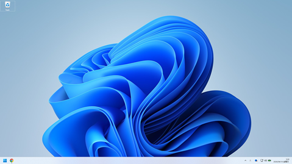
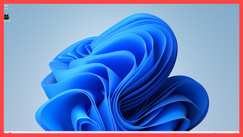

# Eye Rest Reminder
20分ごとに眼の休憩を促します。

数秒間赤枠を表示します。フォーカスは奪いませんし、クリックも透過しますので邪魔になりません。





## Requirements

- Python 3.8+
- Windows 10 / 11

```
pip install pystray Pillow
```

## Usage

```
python eyeres.py
```

タスクバー右下にアイコンが常駐する。20分経過で画面全体に赤枠オーバーレイが表示され、数秒で自動消去。以降ループ。

```
python eyeres.py --debug
```

デバッグでは7秒ごとに枠を表示します。

### トレイメニュー（右クリック）

| 項目 | 動作 |
|------|------|
| ステータス表示 | 次の休憩までの残り時間 |
| 一時停止 / 再開 | タイマーを止める・再開時にリセット |
| タイマーリセット | 20分に戻す |
| 終了 | アプリ終了 |

## Config

`eyeres.py` 冒頭の定数を編集：

```python
WORK_MINUTES = 20          # 通知間隔（分）
NOTIFY_TIMEOUT = 5         # 枠線オーバーレイの表示秒数
BORDER_WIDTH = 30          # 枠線の太さ（px）
BORDER_COLOR = "#FF4444"   # 枠線の色
```

## Architecture

```
メインスレッド ── pystray イベントループ（トレイアイコン + メニュー）
タイマースレッド ── 1秒刻みカウントダウン → 0到達で枠線オーバーレイ表示
```

- 通知は `tkinter` による全画面透明ウィンドウに赤枠を描画。`WS_EX_NOACTIVATE` でフォーカスを奪わず、クリックも貫通する。
- アイコンは `Pillow` で動的生成（動作中: 青、一時停止: オレンジ）。
- スレッド間の状態共有は `threading.Lock` で保護。

## Dependencies

| Package | Role |
|---------|------|
| pystray | システムトレイ常駐 + メニュー |
| Pillow | トレイアイコン画像生成 |

## License

MIT